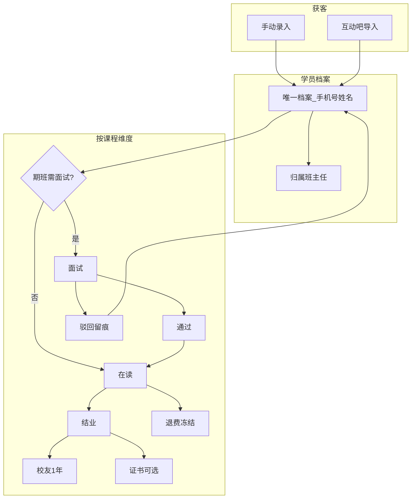
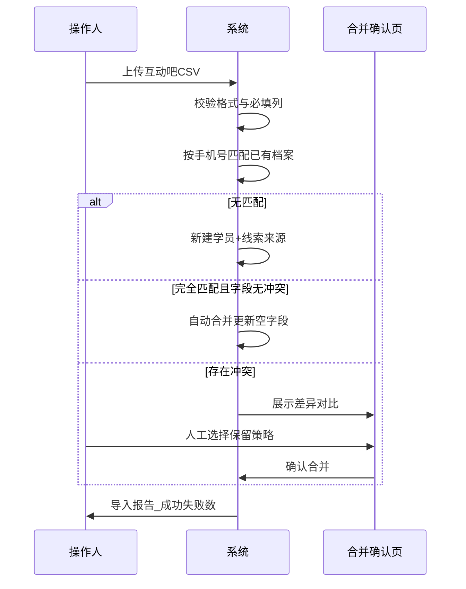
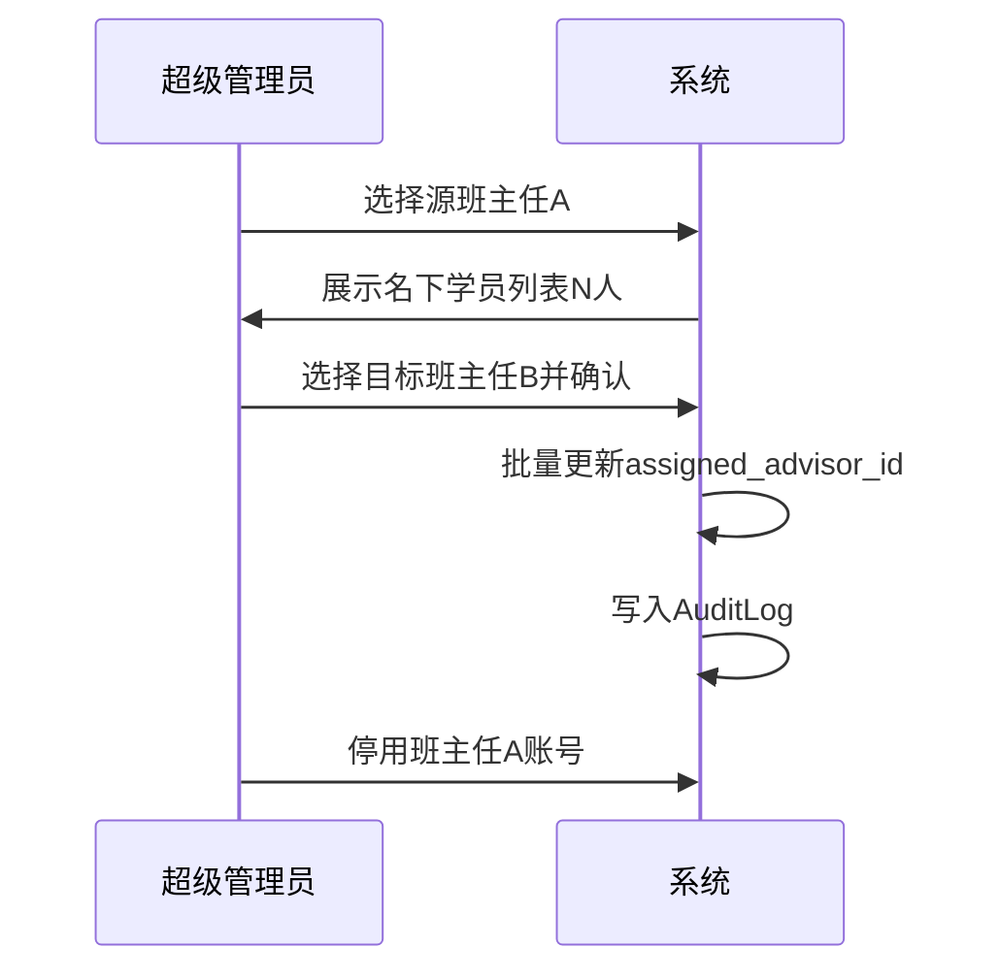
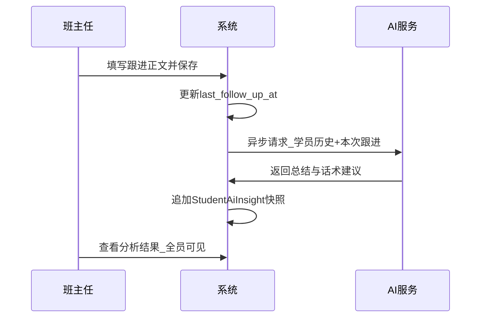
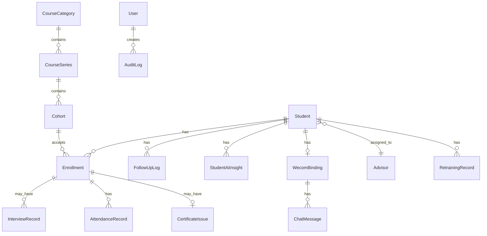
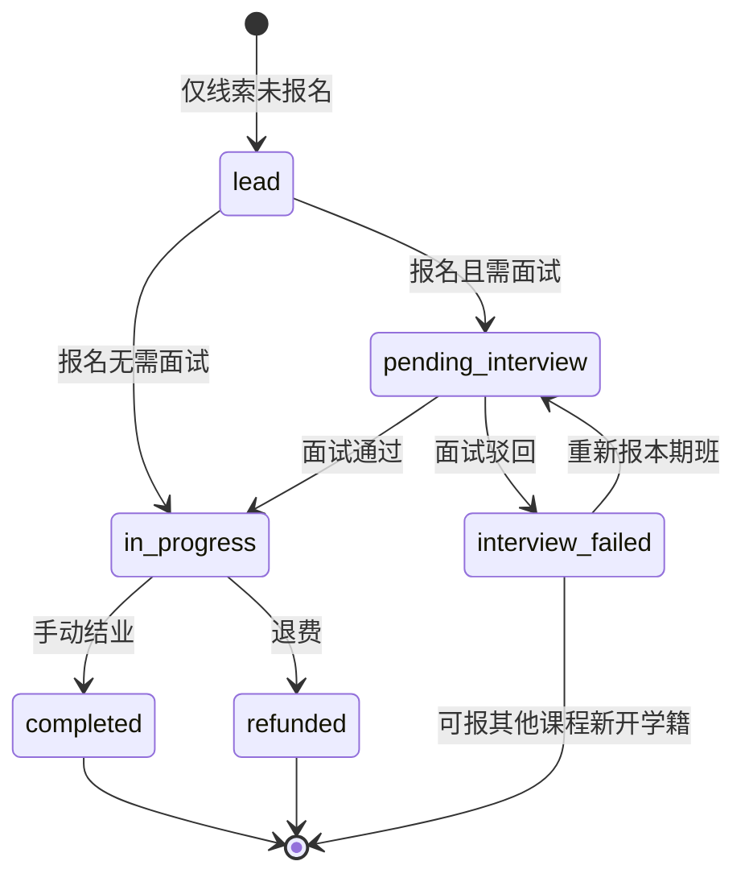
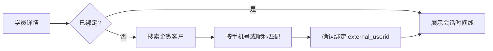

# OPC 学员孵化管理系统 V1.0 — 产品需求文档（PRD）

| 属性 | 内容 |
|------|------|
| 文档版本 | V1.0 |
| 产品版本 | OPC学员孵化管理系统 V1.0 |
| 状态 | 已定稿（待评审） |
| 撰写日期 | 2026-05-29 |
| 需求来源 | [系统建设沟通记录](./系统建设沟通记录.md) |
| 受众 | 业务方 / 管理层、研发团队 |

---

## 修订记录

| 版本 | 日期 | 作者 | 说明 |
|------|------|------|------|
| 1.0 | 2026-05-29 | 产品 | 基于沟通记录首版 PRD |

---

## 目录

- [第一部分：业务主文](#第一部分业务主文)
  - [1. 术语表](#1-术语表)
  - [2. 背景与目标](#2-背景与目标)
  - [3. 用户与角色](#3-用户与角色)
  - [4. 范围边界](#4-范围边界)
  - [5. 核心业务场景与用户故事](#5-核心业务场景与用户故事)
  - [6. 主业务流程](#6-主业务流程)
  - [7. 功能需求清单（FR）](#7-功能需求清单fr)
  - [8. 非功能需求](#8-非功能需求)
  - [9. 风险与依赖](#9-风险与依赖)
- [第二部分：技术附录](#第二部分技术附录)
  - [10. 领域模型与状态机](#10-领域模型与状态机)
  - [11. 权限矩阵（RBAC）](#11-权限矩阵rbac)
  - [12. 核心页面与逻辑 API 清单](#12-核心页面与逻辑-api-清单)
  - [13. 企微 IM 集成方案](#13-企微-im-集成方案)
  - [14. 数据导入 / 去重 / 合并规则](#14-数据导入--去重--合并规则)
  - [15. BI 指标定义](#15-bi-指标定义)
  - [16. 里程碑与版本切片](#16-里程碑与版本切片)
- [附录 A：需求追踪矩阵](#附录-a需求追踪矩阵)

---

# 第一部分：业务主文

## 1. 术语表

| 术语 | 定义 | 备注 |
|------|------|------|
| **OPC** | One Person Company，一人公司 | 培训对象类型称谓；非系统独立实体 |
| **OPC 学员** | 参加宸联 OPC 相关培训的学员 | 在系统中即「学员 / 客户」 |
| **签约 OPC** | 结业后签约挂靠生态的身份 | V1.0 仅为学员档案上的**手动标签**，不在本系统管理生态权益 |
| **学员 / 客户** | 以手机号 + 姓名唯一标识的个人档案 | CRM 核心实体 |
| **班主任** | 销售 / 客户成功角色 | 负责学员跟进、衣食起居；**一名学员仅一名班主任** |
| **培训老师** | 实际上课讲师 | **不使用本系统**，期班可记录讲师姓名作展示 |
| **大课分类** | 课程体系一级 | 如全能方向、技能方向 |
| **系列课程** | 课程体系二级 | 如「全能训练营系列」；同系列价格一致、复训在同系列内进行 |
| **期班** | 课程体系三级，可独立销售的一期开班 | 如「全能训练营第 3 期」；**无前后置依赖** |
| **报名 / 学籍** | 学员购买某期班后产生的交付记录 | 状态独立，可多门并行 |
| **结业** | 某期班交付完成的业务状态 | **与证书无关** |
| **证书** | 某课程完成后可选发放的证明 | 业务动作，不驱动结业状态 |
| **校友** | 某期班结业后 1 年内的权益状态 | 到期可提醒；可通过指定课程人工重新激活 |
| **跟进记录** | 班主任撰写的单向沟通日志 | 学员不可见；供销售领导与本人复盘 |
| **复训** | 曾上过某系列任一期班的学员，再次参加同系列其他期班 | 仅记录，不走完整报名计费逻辑 |
| **线索** | 尚未报名或待跟进的潜在学员 | 来源：手动录入、互动吧导入 |
| **退费** | 学员终止某期班学习 | 标记退费并冻结该学籍，不做复杂计算 |
| **宸联教育** | 培训交付主体 | 销售离职不影响交付，公司兜底 |

**关键辨析（避免歧义）**

- **班主任 ≠ 培训老师**：班主任管 CRM 归属与跟进；培训老师不管本系统账号。
- **结业 ≠ 证书**：结业是状态；证书是可选发放动作。
- **OPC 签约 ≠ 新账号**：在原学员档案加标签，历史数据不迁移。
- **面试未通过 ≠ 全局拉黑**：仅在该期班/课程维度留痕，可报其他课程。

---

## 2. 背景与目标

### 2.1 业务背景

宸联教育面向 OPC（一人公司）方向开展职业培训。学员来源包括社会招聘（简历投递）、手动录入、互动吧等平台导入。业务涵盖：部分高端课程的面试筛选、线下训练营（含多场次上课与考勤）、结业、证书发放、校友权益、复训，以及结业后的「签约 OPC」标签管理。

当前痛点：

- 学员信息、报名、面试、考勤、跟进分散，无统一 CRM 视图。
- 班主任（销售）跟进无结构化沉淀，管理层难以看转化与跟进质量。
- 班主任离职时学员交接依赖人工，易遗漏历史上下文。
- 与学员的企微沟通未与档案打通，无法留痕与辅助话术。

### 2.2 产品定位

**职业教育版 CRM**：学员 = 客户，班主任 = 销售，课程 = 产品线。教学要素（面试、考勤、证书、复训）作为 CRM 的附属交付属性，而非独立教务系统的核心。

**一句话**：学员全生命周期 CRM + 课程交付记录 + 触发式 AI 销售辅助 + 企业微信 IM 全对接。

### 2.3 产品目标（V1.0）

| 目标 | 可衡量指标（上线后 3 个月内观测） |
|------|----------------------------------|
| 学员档案统一 | 100% 在读学员有唯一档案（手机号去重） |
| 跟进可沉淀 | 活跃学员人均 ≥ 1 条/月跟进记录（业务自行考核） |
| 管理可视 | 仪表盘展示 6 项 CRM 转化率，支持 CSV 导出 |
| 交接可审计 | 班主任离职转移 100% 走系统批量操作并留日志 |
| 沟通可留痕 | 已绑定企微的学员，IM 消息入库率 ≥ 95%（收发双向） |

### 2.4 成功标准（验收层面）

- 业务方可在系统中完成：录入/导入学员 → 报名期班 → 面试/考勤/结业 → 跟进 + AI 分析 → 查看 BI → 企微聊天，全流程无纸化。
- 管理员可完成班主任离职批量转移，新班主任可见完整历史。
- 学员端、培训老师端不存在任何入口。

---

## 3. 用户与角色

### 3.1 角色定义

| 角色 | 说明 | 典型用户 |
|------|------|----------|
| **超级管理员** | 系统配置、用户与角色、课程树维护、全局数据、班主任离职转移、企微应用配置 | IT / 运营负责人 |
| **业务管理员** | 查看全部班主任与学员数据、团队 BI、导出、审计 IM（可配置） | 销售领导 |
| **班主任** | 仅自己的学员；写跟进、录面试/考勤（若授权）、发起企微会话、查看 AI 分析 | 销售 / 客户成功 |
| **面试官** | 可复用班主任账号或单独权限：提交面试结论与转写 | 面试官 |

### 3.2 明确排除的角色

| 角色 | V1.0 策略 |
|------|-----------|
| 学员 | 无登录、不可查看档案/跟进/AI 结果 |
| 培训老师 | 无账号；期班仅可填「讲师姓名」文本 |
| 财务 / 合同 | 不做定价、合同、退费计算 |

### 3.3 权限原则

- **数据隔离**：班主任默认仅见 `assigned_advisor_id = 自己` 的学员。
- **管理穿透**：业务管理员、超级管理员可见全部。
- **AI 与面试分析**：全体班主任可读（跨学员档案内的分析区块）。
- **永久保留**：所有业务数据不自动删除（沟通记录确认）。

---

## 4. 范围边界

### 4.1 V1.0 必做（In Scope）

| 模块 | 范围摘要 |
|------|----------|
| 学员 CRM | 唯一档案、标签、跟进、最后跟进时间、详情聚合视图 |
| 线索获客 | 手动录入、互动吧 CSV 导入、来源字段 |
| 课程体系 | 大课分类 → 系列 → 期班；期班独立销售、无前置课 |
| 学籍管理 | 多课程并行、独立状态、退费冻结 |
| 面试 | 按课程配置是否需面试；通过/驳回；转写 + AI 提取（不改主档） |
| 考勤 | 期班签到记录（必做） |
| 结业 / 校友 / 证书 | 结业状态、校友 1 年、证书发放记录、复训记录 |
| 班主任管理 | 唯一归属、离职批量转移、审计日志 |
| AI | 跟进保存后触发分析；无分析时手动触发；面试 AI 提取 |
| BI | 6 项转化率仪表盘、待跟进列表（展示）、CSV 导出 |
| 企微 IM | 客户联系绑定、系统内会话时间线、双向发消息、入库留痕 |

### 4.2 V1.0 不做（Non-Goals）

| 排除项 | 说明 |
|--------|------|
| 学员自助端 | 学员不能登录查档案 |
| 培训老师端 | 教师不使用本系统 |
| 评分 / 作业系统 | 明确不要评分（沟通记录） |
| 定价 / 折扣 / 套餐 / 合同 | 其他系统处理；本系统只记录买了哪门期班 |
| 部分退课 / 退费计算 | 退费仅标记状态 |
| OPC 生态 / 订单推荐 | 签约 OPC 仅标签 |
| 课程版本 / 迭代管理细节 | 期班名称快照存档即可 |
| 自动跟进推送提醒 | 可做仪表盘静态列表，不做消息推送 |
| 公海池 / 无人认领学员 | 学员必须始终有班主任 |
| 线索第 N 次申请计数 | 不做 |
| 销售防刷（同日多条跟进限制） | 不做 |
| 5 年后数据归档删除 | 永久保留 |
| 个人微信官方对接 | 仅企业微信「客户联系」体系 |
| 自动化获客渠道 | 仅人工录入 + 互动吧导入 |

### 4.3 后续版本展望（Out of Scope for V1.0）

- 跟进沉默学员自动提醒（推送）
- 套餐定价与优惠在本系统配置
- 课程顾问工作考核防刷
- 学员自助查询有限信息
- 与 OPC 生态系统的深度集成（订单、推荐位）

---

## 5. 核心业务场景与用户故事

### Epic A：学员与客户档案

**US-A1** 作为班主任，我希望用手机号录入新学员，以便开始跟进。

- **AC-A1.1** Given 手机号未存在，When 填写姓名+手机号保存，Then 创建学员档案并默认归属当前班主任。
- **AC-A1.2** Given 手机号已存在，When 录入相同手机号，Then 提示已存在并引导至已有档案（不静默新建）。
- **AC-A1.3** Given 需更正手机号，When 管理员/班主任编辑手机号，Then 在原档案更新，不新建档案，并写审计日志。

**US-A2** 作为班主任，我希望在学员详情页看到其全部课程与历史，以便一次跟进掌握全貌。

- **AC-A2.1** 详情页展示：基本信息、标签、所属班主任、已报期班列表（含状态）、跟进记录时间线、AI 分析、企微会话入口、最后跟进时间。
- **AC-A2.2** 支持手动添加/移除标签（含「签约 OPC」）。

**US-A3** 作为班主任，我希望记录跟进内容且学员看不到，以便内部复盘。

- **AC-A3.1** 可新增跟进正文；保存后更新 `last_follow_up_at`。
- **AC-A3.2** 学员无任何入口查看跟进与 AI 内容。

**US-A4** 作为管理员，我希望从互动吧导入线索并去重，以便批量获客。

- 见 [14. 数据导入规则](#14-数据导入--去重--合并规则)。

**US-A5** 作为班主任，我希望将某期班标记为退费，以便停止跟进该交付。

- **AC-A5.1** 退费后该学籍状态为 `refunded`，冻结后续考勤/结业操作。
- **AC-A5.2** 学员档案与其他期班不受影响。

---

### Epic B：班主任与组织

**US-B1** 作为管理员，我希望在班主任离职前将其学员批量转给另一班主任，以便无缝交接。

- **AC-B1.1** 源班主任名下学员数 > 0 时，不可完成「离职/停用」直至转移完成。
- **AC-B1.2** 支持选择源班主任、目标班主任、学员范围（默认全选），一键转移。
- **AC-B1.3** 转移后目标班主任可见全部历史跟进、学籍、面试、AI 分析；学员不收到通知。
- **AC-B1.4** 产生审计日志：操作人、时间、源/目标班主任、学员 ID 列表。

**US-B2** 作为业务规则，每名学员同时仅有一名班主任（销售归属）。

- **AC-B2.1** 学员档案 `assigned_advisor_id` 唯一；报多门课不改变归属。
- **AC-B2.2** 多期班可有不同培训老师（文本字段），与班主任无关。

---

### Epic C：课程体系与报名

**US-C1** 作为管理员，我希望维护「大课分类 → 系列 → 期班」树，以便销售报名时有可选产品。

- **AC-C1.1** 三级结构可 CRUD；期班含：名称、系列归属、开班时间、是否需面试、状态（招生中/已结束等）。
- **AC-C1.2** 期班之间无前置依赖配置。

**US-C2** 作为班主任，我希望为学员报名某期班，以便开始交付流程。

- **AC-C2.1** 报名后创建独立学籍（Enrollment）；初始状态：无需面试 → `enrolled`；需面试 → `pending_interview`。
- **AC-C2.2** 同一学员可有多条并行学籍。
- **AC-C2.3** 期班下线后，已有学籍仍显示报名时的期班名称快照。

**US-C3** 作为班主任，我希望记录学员在某系列的复训，以便留痕。

- **AC-C3.1** 学员曾在该系列任一期班有过 `completed` 或 `enrolled` 历史即可登记复训。
- **AC-C3.2** 复训记录含：学员、系列、参加期班、日期、备注；不替代原学籍。

---

### Epic D：面试

**US-D1** 作为面试官，我希望对需面试的期班提交面试结论与转写，以便决策是否录取。

- **AC-D1.1** 仅 `cohort.requires_interview = true` 的学籍可走面试流。
- **AC-D1.2** 提交字段：结论（通过/驳回）、面试评语、录音转写文本（可选附件）。
- **AC-D1.3** 驳回后学籍状态 `interview_failed`，档案保留；学员可报名其他期班。
- **AC-D1.4** 通过后状态变为 `enrolled`（或 `in_progress`，若已开课）。

**US-D2** 作为班主任，我希望查看面试 AI 提取的关键信息，以便了解学员画像。

- **AC-D2.1** AI 仅写入面试记录的 `ai_extract` 附属字段，**不修改**学员主档。
- **AC-D2.2** 全体班主任可查看该分析结果。

---

### Epic E：交付、结业、校友、证书

**US-E1** 作为班主任/教务操作人，我希望为学员记录上课签到，以便证明到课。

- **AC-E1.1** 按学籍 + 上课日期/场次记录签到（支持一期班多次上课）。
- **AC-E1.2** 不做评分、不与签到自动挂钩结业（V1.0 简化）。

**US-E2** 作为班主任，我希望将某学籍标记为结业，以便进入校友阶段。

- **AC-E2.1** 手动标记结业 → 状态 `completed`，记录 `completed_at`。
- **AC-E2.2** 若学员仍在读其他期班，仅该学籍结业，不影响其他学籍。
- **AC-E2.3** 未上完课学员保持 `in_progress`，可继续上课后结业。

**US-E3** 作为班主任，我希望在结业后发放证书记录（可选），以便与结业状态解耦。

- **AC-E3.1** 证书发放为独立动作，记录发放时间与备注；不自动触发结业。

**US-E4** 作为系统，学员结业后应进入校友期 1 年，并在到期时可提醒。

- **AC-E4.1** 结业后 `alumni_status = active`，`alumni_expires_at = completed_at + 1 year`（学员维度或学籍维度：V1.0 采用**学籍维度**记录，学员档案展示最近活跃校友到期日）。
- **AC-E4.2** 仪表盘/列表可筛选「即将到期校友」；到期后 `alumni_status = expired`。
- **AC-E4.3** 通过报名指定「校友激活课程」后，管理员可人工将校友状态重新激活（操作留痕）。

---

### Epic F：触发式 AI

**US-F1** 作为班主任，我在保存跟进记录后希望获得 AI 总结与话术建议，以便下次沟通。

- **AC-F1.1** 保存跟进后异步调用 AI，生成：学员情况总结、下次建议话术、抛钩子建议。
- **AC-F1.2** **禁止**进入档案自动生成、禁止定时刷新。
- **AC-F1.3** 若尚无分析记录，展示「手动生成分析」按钮，点击触发一次。
- **AC-F1.4** 分析结果全体班主任可见；保留历史分析快照（不覆盖，按时间倒序）。

**US-F2** 作为 AI 输入，系统可使用跟进正文；若企微会话已授权存档，可作为可选补充输入（见 Epic H）。

---

### Epic G：数据大盘与导出

**US-G1** 作为班主任，我希望在仪表盘看到自己的跟进与转化数据。

- **AC-G1.1** 班主任仅见个人指标；业务管理员/超管见全员与汇总。
- **AC-G1.2** 展示 6 项指标（定义见 [15. BI 指标定义](#15-bi-指标定义)）。
- **AC-G1.3** 展示「待跟进学员」列表（如 30 天无跟进），**不发送推送**。

**US-G2** 作为业务管理员，我希望导出 CSV，以便线下分析。

- **AC-G2.1** 支持导出：学员列表、跟进记录、学籍列表、面试记录（权限与可见范围一致）。

---

### Epic H：企微 IM 全对接

见 [13. 企微 IM 集成方案](#13-企微-im-集成方案)。

---

## 6. 主业务流程

### 6.1 学员全生命周期总览

### 6.2 互动吧导入与去重

### 6.3 班主任离职转移

### 6.4 跟进与 AI 分析

---

## 7. 功能需求清单（FR）

| FR 编号 | 描述 | 优先级 | 验收要点 |
|---------|------|--------|----------|
| **FR-A01** | 学员档案 CRUD，手机号唯一 | P0 | AC-A1.x |
| **FR-A02** | 学员详情聚合视图 | P0 | AC-A2.x |
| **FR-A03** | 标签管理（含签约 OPC） | P1 | 手动打标 |
| **FR-A04** | 跟进记录 CRUD | P0 | AC-A3.x |
| **FR-A05** | 线索来源字段 | P1 | manual / hudongba |
| **FR-A06** | 互动吧 CSV 导入 | P0 | 第 14 章 |
| **FR-A07** | 退费标记 | P0 | AC-A5.x |
| **FR-B01** | 班主任账号与角色 | P0 | RBAC |
| **FR-B02** | 学员唯一班主任归属 | P0 | AC-B2.x |
| **FR-B03** | 班主任离职批量转移 | P0 | AC-B1.x |
| **FR-B04** | 操作审计日志 | P0 | 转移/合并/手机号变更 |
| **FR-C01** | 课程三级树维护 | P0 | AC-C1.x |
| **FR-C02** | 学籍报名 | P0 | AC-C2.x |
| **FR-C03** | 期班名称快照 | P1 | 下线不丢历史 |
| **FR-C04** | 复训记录 | P1 | AC-C3.x |
| **FR-D01** | 期班「需面试」配置 | P0 | — |
| **FR-D02** | 面试提交与状态流转 | P0 | AC-D1.x |
| **FR-D03** | 面试 AI 提取 | P1 | AC-D2.x |
| **FR-E01** | 考勤签到 | P0 | AC-E1.x |
| **FR-E02** | 结业标记 | P0 | AC-E2.x |
| **FR-E03** | 证书发放记录 | P1 | AC-E3.x |
| **FR-E04** | 校友状态与到期 | P0 | AC-E4.x |
| **FR-E05** | 校友人工激活 | P1 | AC-E4.3 |
| **FR-F01** | 跟进后触发 AI 分析 | P0 | AC-F1.x |
| **FR-F02** | 手动触发 AI 分析 | P0 | 无历史时 |
| **FR-F03** | AI 分析历史快照 | P1 | 不覆盖 |
| **FR-G01** | BI 仪表盘 | P0 | 第 15 章 |
| **FR-G02** | 待跟进学员列表 | P1 | 无推送 |
| **FR-G03** | CSV 导出 | P0 | AC-G2.x |
| **FR-H01** | 企微应用配置 | P0 | 第 13 章 |
| **FR-H02** | 学员-企微客户绑定 | P0 | 第 13 章 |
| **FR-H03** | IM 会话时间线展示 | P0 | 第 13 章 |
| **FR-H04** | 系统内发送企微消息 | P0 | 第 13 章 |
| **FR-H05** | 消息入库与同步 | P0 | 第 13 章 |

---

## 8. 非功能需求

| 类别 | 要求 |
|------|------|
| **可用性** | 管理后台 Web；支持 Chrome 最新两个大版本；核心列表首屏 ≤ 3s（千级学员量级） |
| **安全** | 登录鉴权；HTTPS；班主任数据隔离；敏感操作审计 |
| **数据保留** | 永久保留，不自动删除 |
| **可靠性** | AI / 企微调用失败可重试；导入支持事务回滚报告 |
| **合规** | 企微消息存档需符合企业隐私政策；学员知情同意由业务线下保障 |
| **可维护性** | 期班快照、学籍状态变更留 `updated_at` 与操作人 |

---

## 9. 风险与依赖

| 风险 | 影响 | 缓解 |
|------|------|------|
| 企微资质未就绪 | IM 无法上线 | 提前申请客户联系与自建应用；M4 可独立排期 |
| 互动吧导出格式变更 | 导入失败 | 模板可配置列映射 |
| AI 服务不稳定 | 分析延迟或失败 | 异步队列 + 失败重试 + 手动重触发 |
| 需求蔓延（定价/评分） | 延期 | 严格遵守 Non-Goals |
| 个人微信诉求 | 无法官方实现 | PRD 明确仅企微客户联系 |

**外部依赖**：企业微信开放平台、AI LLM API（话术与面试提取）、互动吧导出文件。

---

# 第二部分：技术附录

## 10. 领域模型与状态机

### 10.1 实体关系（ER 概要）

### 10.2 核心实体字段（逻辑模型）

**Student（学员）**

| 字段 | 类型 | 说明 |
|------|------|------|
| id | UUID | 主键 |
| phone | string | 唯一，去重键 |
| name | string | 姓名 |
| assigned_advisor_id | FK | 班主任 |
| tags | string[] | 含「签约_OPC」等 |
| source | enum | manual, hudongba, other |
| last_follow_up_at | datetime | 最后跟进时间 |
| created_at / updated_at | datetime | — |

**Advisor（班主任/销售）**

| 字段 | 类型 | 说明 |
|------|------|------|
| id | UUID | — |
| name | string | — |
| wecom_userid | string | 企微成员 ID，用于发消息 |
| status | enum | active, inactive |
| role | enum | advisor, admin, super_admin |

**CourseCategory / CourseSeries / Cohort**

- Cohort 额外字段：`requires_interview`, `start_date`, `end_date`, `status`, `instructor_name`（文本）, `snapshot_name`（报名快照用）

**Enrollment（学籍）**

| 字段 | 类型 | 说明 |
|------|------|------|
| student_id, cohort_id | FK | — |
| cohort_snapshot_name | string | 报名时期班名 |
| status | enum | 见状态机 |
| alumni_status | enum | none, active, expired |
| alumni_expires_at | datetime | 结业后 +1 年 |
| completed_at | datetime | — |

**FollowUpLog**

| 字段 | 类型 | 说明 |
|------|------|------|
| student_id, advisor_id | FK | — |
| content | text | 跟进正文 |
| created_at | datetime | — |

**StudentAiInsight**

| 字段 | 类型 | 说明 |
|------|------|------|
| student_id | FK | — |
| trigger_type | enum | follow_up_saved, manual |
| trigger_ref_id | UUID | 关联跟进 ID（可选） |
| summary, next_talk, hooks | text | AI 输出 |
| created_by | FK | 触发人 |
| created_at | datetime | — |

**WecomBinding / ChatMessage** — 见第 13 章。

### 10.3 学籍状态机

| 状态 | 含义 |
|------|------|
| `lead` | 线索，未报名（可选，或仅用 Student 无 Enrollment） |
| `pending_interview` | 已报名待面试 |
| `interview_failed` | 该期班面试未通过 |
| `in_progress` | 在读 |
| `completed` | 已结业 |
| `refunded` | 已退费冻结 |

**说明**：面试未通过不阻止同一学员对其他 Cohort 新建 `Enrollment`。

### 10.4 校友状态（学籍维度）

| alumni_status | 条件 |
|---------------|------|
| `none` | 未结业 |
| `active` | 已结业且 now < alumni_expires_at |
| `expired` | 已结业且 now ≥ alumni_expires_at |

---

## 11. 权限矩阵（RBAC）

| 能力 | 班主任 | 业务管理员 | 超级管理员 |
|------|:------:|:----------:|:----------:|
| 查看自己的学员 | ✓ | ✓ | ✓ |
| 查看全部学员 | ✗ | ✓ | ✓ |
| 创建/编辑学员（自己的） | ✓ | ✓ | ✓ |
| 创建/编辑学员（他人的） | ✗ | ✓ | ✓ |
| 写跟进（自己的学员） | ✓ | ✓ | ✓ |
| 读全部跟进 | ✗ | ✓ | ✓ |
| 课程树维护 | ✗ | ✓ | ✓ |
| 学籍报名/结业/退费 | ✓（自己的） | ✓ | ✓ |
| 面试录入 | ✓* | ✓ | ✓ |
| 考勤录入 | ✓* | ✓ | ✓ |
| 批量转移学员 | ✗ | ✓ | ✓ |
| 用户/角色管理 | ✗ | ✗ | ✓ |
| 仪表盘（个人） | ✓ | ✓ | ✓ |
| 仪表盘（全员） | ✗ | ✓ | ✓ |
| CSV 导出 | 自己的 | 全部 | 全部 |
| 查看 AI 分析（全员） | ✓ | ✓ | ✓ |
| 企微会话（自己的学员） | ✓ | 可配置 | ✓ |
| 企微应用配置 | ✗ | ✗ | ✓ |

\* 可通过角色配置是否允许面试/考勤操作。

---

## 12. 核心页面与逻辑 API 清单

### 12.1 页面清单

| 路由（建议） | 页面 | 主要角色 |
|--------------|------|----------|
| `/login` | 登录 | 全部 |
| `/dashboard` | BI 仪表盘 | 全部 |
| `/students` | 学员列表 | 班主任+ |
| `/students/:id` | 学员详情（Tab：概览/学籍/跟进/AI/企微） | 班主任+ |
| `/students/import` | 互动吧导入 | 管理员+ |
| `/cohorts` | 期班列表 | 管理员+ |
| `/cohorts/:id` | 期班详情（学员名单、考勤入口） | 管理员+ |
| `/courses` | 课程树管理 | 超级管理员 |
| `/advisors` | 班主任管理 | 超级管理员 |
| `/advisors/:id/transfer` | 离职转移向导 | 超级管理员 |
| `/merge` | 导入冲突合并 | 管理员+ |
| `/settings/wecom` | 企微配置 | 超级管理员 |
| `/audit-logs` | 审计日志 | 超级管理员 |

### 12.2 逻辑 API 分组（REST 风格建议）

| 前缀 | 示例 | 说明 |
|------|------|------|
| `/api/students` | GET/POST/PATCH | 学员 CRUD |
| `/api/students/:id/follow-ups` | GET/POST | 跟进 |
| `/api/students/:id/ai-insights` | GET/POST | 手动触发 AI |
| `/api/students/import` | POST | 互动吧导入 |
| `/api/students/merge` | POST | 确认合并 |
| `/api/enrollments` | CRUD | 学籍 |
| `/api/enrollments/:id/interview` | POST | 面试提交 |
| `/api/enrollments/:id/attendance` | POST | 签到 |
| `/api/enrollments/:id/complete` | POST | 结业 |
| `/api/enrollments/:id/refund` | POST | 退费 |
| `/api/enrollments/:id/certificate` | POST | 发证 |
| `/api/retrainings` | POST | 复训登记 |
| `/api/cohorts` | CRUD | 期班 |
| `/api/course-tree` | CRUD | 分类/系列 |
| `/api/advisors/:id/transfer` | POST | 批量转移 |
| `/api/dashboard/metrics` | GET | BI 指标 |
| `/api/export/:type` | GET | CSV |
| `/api/wecom/bind` | POST | 绑定客户 |
| `/api/wecom/messages` | GET/POST | 会话同步与发送 |
| `/api/wecom/webhook` | POST | 企微回调 |

---

## 13. 企微 IM 集成方案

### 13.1 目标（V1.0 必达）

- 班主任在系统内查看与学员的企微聊天记录（时间线）。
- 班主任在系统内主动向学员发送企微消息（文本为首期，图片/文件为 P1）。
- 学员发送的消息通过回调入库，与跟进记录并列展示。
- 消息永久入库（与系统数据保留策略一致）。

### 13.2 推荐方案

采用 **企业微信「客户联系」+ 自建应用 + 消息回调**（非个人微信）。

| 组件 | 用途 |
|------|------|
| 客户联系 Secret | 管理外部联系人、获取 `external_userid` |
| 自建应用 AgentId | 成员发消息、接收事件 |
| 回调 URL | 接收消息与联系人变更事件 |
| 会话内容存档（可选） | 若企业已购买会话存档，可同步历史消息；否则仅收回调后消息 |

**不推荐**：个人微信协议 Hook（合规风险）；**不在范围**。

### 13.3 绑定流程

| 步骤 | 说明 |
|------|------|
| 1 | 班主任在学员详情点击「绑定企微」 |
| 2 | 系统调用「获取客户列表」或侧边栏传入的 `external_userid` |
| 3 | 支持按手机号匹配（若企微客户备注含手机号）或人工搜索选择 |
| 4 | 写入 `WecomBinding(student_id, external_userid, bound_at, bound_by)` |
| 5 | 绑定后可拉取历史消息（若开通存档）并开始接收回调 |

### 13.4 消息同步与发送

| 方向 | 机制 |
|------|------|
| 学员 → 员工 | 企微回调 `msg` 事件 → 验签 → 入库 `ChatMessage` |
| 员工 → 学员 | 系统调用「发送消息到客户」API，成员须为配置了客户联系的 `advisor.wecom_userid` |
| 系统展示 | 学员详情「企微」Tab：按 `sent_at` 排序，区分 in/out |

**ChatMessage 字段**：`id`, `student_id`, `advisor_id`, `direction` (in/out), `msg_type`, `content`, `wecom_msg_id`, `sent_at`, `raw_payload`（json）

### 13.5 权限与审计

- 班主任仅可查看/发送**自己名下学员**且已绑定的会话。
- 业务管理员、超级管理员可配置是否可查看他人会话（默认管理员可读全部，用于质检）。
- 发送消息记录 `advisor_id` 与系统操作日志。

### 13.6 AI 与 IM 的关系

- 跟进保存触发 AI 时，输入默认：学员档案 + 全部跟进记录 + 最新一条跟进。
- **可选增强**：若 `ChatMessage` 存在且企业合规允许，可将最近 N 条企微消息一并送入 Prompt（配置开关，默认关闭直至法务确认）。

### 13.7 验收标准（Epic H）

| 编号 | Given-When-Then |
|------|-----------------|
| H-AC1 | Given 学员已绑定企微，When 学员向班主任发文本消息，Then 30s 内在系统时间线可见 |
| H-AC2 | Given 已绑定，When 班主任在系统发送消息，Then 学员企微收到且系统标记为 outbound |
| H-AC3 | Given 未绑定，When 打开企微 Tab，Then 引导完成绑定而非空白报错 |
| H-AC4 | Given 班主任 B 接手学员，When 查看企微 Tab，Then 可见历史消息（绑定关系随学员档案保留） |
| H-AC5 | Given 非本人学员，When 班主任 A 访问，Then 403 |

### 13.8 待业务确认清单

| # | 事项 | 负责方 |
|---|------|--------|
| 1 | 企业微信主体与认证是否已完成 | 行政/IT |
| 2 | 是否采购「会话内容存档」 | 管理层 |
| 3 | 客户联系使用范围（哪些班主任开通） | 销售负责人 |
| 4 | 聊天记录用于 AI 分析是否需学员额外授权 | 法务 |
| 5 | 消息类型范围（仅文本 / 含图片文件） | 产品 |
| 6 | 成员 `wecom_userid` 与系统账号映射方式 | IT |

---

## 14. 数据导入 / 去重 / 合并规则

### 14.1 互动吧导入模板（最低必填）

| 列名 | 映射字段 | 必填 |
|------|----------|------|
| 手机号 | phone | 是 |
| 姓名 | name | 是 |
| 备注 | import_note | 否 |

支持上传前下载系统模板；列名不一致时提供**列映射 UI**（FR 扩展）。

### 14.2 去重规则

1. 以 **手机号** 为唯一匹配键（规范化：去空格、可选统一 +86 处理）。
2. 无匹配 → 新建 `Student`，`source = hudongba`，默认归属**导入操作人**（若操作人为班主任）或进入「待分配池」由管理员分配——**V1.0 采用：归属导入操作人**，管理员可事后调整。

### 14.3 合并规则

| 场景 | 行为 |
|------|------|
| 手机号相同、姓名相同、无字段冲突 | **自动合并**：更新空字段，不覆盖已有非空字段 |
| 手机号相同、姓名不同 | **人工确认**：展示两条记录差异，操作人选择保留姓名/合并为同一人/跳过 |
| 手机号相同、其他字段冲突 | **人工确认** |
| 导入行无效（无手机号） | 跳过并写入失败报告 |

### 14.4 导入结果报告

- 成功新建 N 条、合并 M 条、跳过 K 条、待确认 L 条；
- 可下载失败行 CSV。

---

## 15. BI 指标定义

统计周期默认：**自然月**，支持筛选日期范围与班主任范围。

| 指标编号 | 名称 | 分子 | 分母 | 说明 |
|----------|------|------|------|------|
| **M1** | 线索→报名转化率 | 期内新建学籍数 | 期内新建学员档案数（含仅线索） | 衡量从留资到成交 |
| **M2** | 报名→开课转化率 | 状态进入 `in_progress` 的学籍数 | 期内新建学籍数 | 面试类需先通过面试 |
| **M3** | 开课→结业转化率 | 期内 `completed` 学籍数 | 期初 `in_progress` + 本期新增开课 | 交付完成度 |
| **M4** | 面试通过率 | 面试通过学籍数 | 提交面试结论的学籍数 | 仅 `requires_interview`  cohort |
| **M5** | 校友激活率 | 期内校友状态从 expired→active 人次 | 期内 alumni 到期人次 | 人工激活+报激活课 |
| **M6** | 跟进覆盖率 | 期内有 ≥1 条跟进的学员数 | 期内应跟进学员数（归属班主任的 active 学员） | 运营健康度 |

**衍生展示（仪表盘卡片，非独立 KPI）**

- 人均跟进次数 = 跟进条数 / 班主任数
- 待跟进学员数 = `last_follow_up_at` 早于 30 天或无跟进的在读学员

**权限**：班主任仅 M1–M6 个人维度；管理员看团队汇总与排行榜。

---

## 16. 里程碑与版本切片

V1.0 功能范围不变，建议研发排期：

| 里程碑 | 交付内容 | 依赖 |
|--------|----------|------|
| **M1** | 学员档案、课程树、学籍、跟进、RBAC 登录 | — |
| **M2** | 面试、考勤、结业、校友、证书、复训 | M1 |
| **M3** | 互动吧导入与合并、班主任转移、BI 仪表盘、CSV 导出 | M1 |
| **M4** | 触发式 AI、企微 IM 全对接 | M1；企微资质 |

---

## 附录 A：需求追踪矩阵

| 沟通记录要点 | FR / 章节 | 状态 |
|--------------|-----------|------|
| 学员全生命周期管理 | §6、FR-C/E | ✓ |
| OPC=一人公司培训学员 | §1 术语 | ✓ |
| 面试→线下课；淘汰留痕 | FR-D02、§10.3 | ✓ |
| 考勤签到必须 | FR-E01 | ✓ |
| 无评分系统 | §4.2 Non-Goals | ✓ |
| 证书与结业无关 | FR-E02/E03、术语 | ✓ |
| 三条出路/签约 OPC=标签 | FR-A03、Non-Goals | ✓ |
| 退费=冻结中断 | FR-A07 | ✓ |
| 一学员一班主任（销售） | FR-B02 | ✓ |
| 培训老师不在系统 | §3.2 | ✓ |
| 班主任离职批量转移 | FR-B03 | ✓ |
| 校友 1 年 | FR-E04 | ✓ |
| 复训记录 | FR-C04 | ✓ |
| 课程系列→期班，无前置 | FR-C01/C02 | ✓ |
| 多课程可并行购买 | FR-C02 | ✓ |
| 跟进记录=sales 日志，学员不可见 | FR-A04 | ✓ |
| 触发式 AI 话术 | FR-F01/F02 | ✓ |
| AI 全体班主任可见 | §3.3、FR-F01 | ✓ |
| 面试 AI 不改主档 | FR-D03 | ✓ |
| 互动吧导入+手机号去重 | FR-A06、§14 | ✓ |
| 手动合并冲突 | §14.3 | ✓ |
| BI 5–6 指标+CSV | FR-G01/G03、§15 | ✓ |
| 仪表盘权限分层 | §11、FR-G01 | ✓ |
| 永久保留 | §8 | ✓ |
| 企微 IM 全对接 | §13、FR-H | ✓ |
| 不做定价/套餐/部分退课 | §4.2 | ✓ |
| 不做自动跟进推送 | §4.2、FR-G02 | ✓ |
| 不做学员/老师端 | §3.2、§4.2 | ✓ |
| 互动吧+手动线索 | FR-A05/A06 | ✓ |
| 面试按课程非全局 | FR-D01 | ✓ |
| 面试失败可报其他课 | §10.3 | ✓ |

---

**文档结束**

*下一步建议：评审 PRD → 输出原型/接口设计 → 按 M1–M4 排期开发。*
